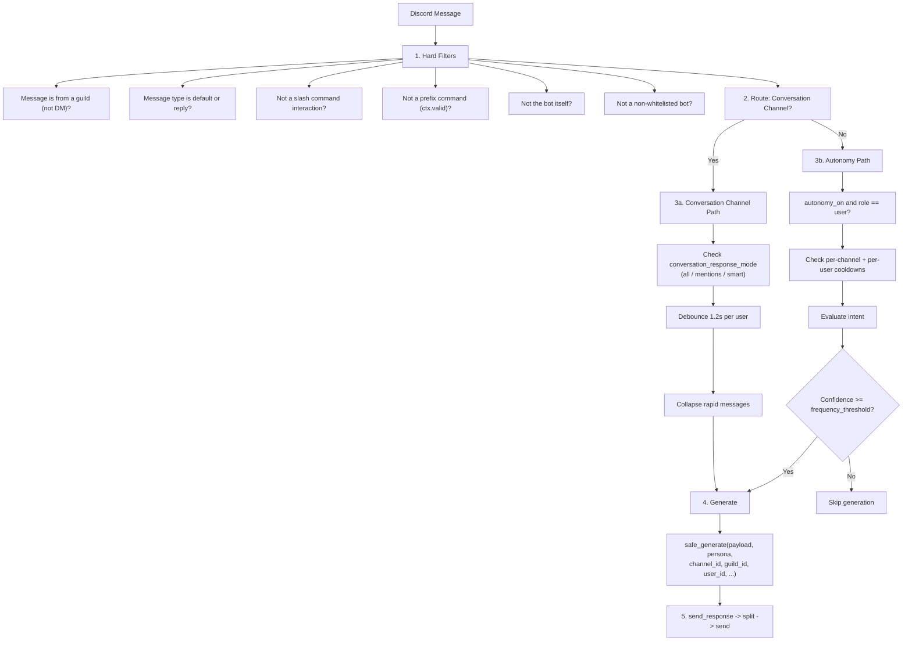
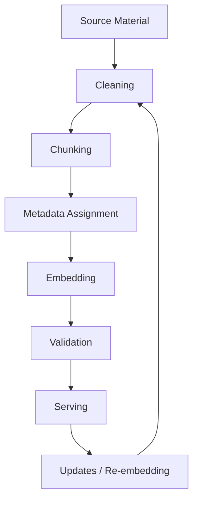

# Architecture

This document explains how Freesona is structured internally. It is intended for developers who want to understand the codebase, extend it, or debug it.

---

## Component Layout

```text
Freesona/
├── main.py                   # Bot startup, intents, prefix, on_ready, HTTP server (port via HTTP_PORT env var, default 10000)
├── fastapi_server.py         # FastAPI health + MVSEP webhook receiver
├── cogs/
│   ├── ai/
│   │   ├── genai.py          # Aggregate AI extension loader (registers split AI cogs)
│   │   ├── genai_listener.py # on_message pipeline + passive autonomy response path
│   │   ├── genai_generation.py # write / ask / search commands
│   │   ├── genai_persona.py  # setpersona + persona profile/lock/debug commands
│   │   ├── genai_memory.py   # conversation + long-term memory commands
│   │   ├── genai_channel.py  # setchannel / clearchannel / chatmode
│   │   └── genai_autonomy.py # autonomy + botwhitelist runtime controls
│   ├── media/
│   │   ├── mvsep.py          # Audio stem separation via MVSEP API
│   │   └── ytdlp.py          # Video/audio downloader via yt-dlp + ffmpeg
│   ├── moderation/
│   │   ├── core.py           # Kick, ban, timeout, purge
│   │   └── warns.py          # Warn, delwarn, warnthresholds
│   ├── system/
│   │   ├── admin.py          # Module, model, provider, sync, timezone, dumpconfig
│   │   ├── help.py           # Custom help panel
│   │   ├── news.py           # RSS/Atom feed fetching and auto-posting
│   │   └── status.py         # /ping
│   ├── tools/
│   │   ├── math.py           # Local SymPy solver + Wolfram Alpha fallback + plot
│   │   └── ping.py           # Latency probe
│   └── fun/
│       ├── hello.py          # ~hello
│       └── random.py         # coinflip, roll, pick, randommember
└── utils/
    ├── canon.py              # Canon Framework — modular immutable identity components
    ├── character_memory.py   # Character Memory — shared experiences, promises, relationships
    ├── config.py             # Config I/O (config.json), embed_footer
    ├── conversation.py       # ConversationManager — short-term memory, budgets, context
    ├── generation.py         # Provider orchestration, PromptBuilder integration, send_response
    ├── guild_world.py        # Guild World Context — environmental grounding
    ├── intent.py             # Confidence-scored intent evaluator for autonomy
    ├── memory.py             # SQLite long-term facts (legacy interaction IDs deprecated)
    ├── modules.py            # Cog registry (OPTIONAL_MODULES, CORE_EXTENSIONS)
    ├── persona.py            # Persona data layer, /setpersona panel modals
    ├── prompt_builder.py     # PromptBuilder & ContextProvider architecture
    ├── prompt_builder_providers.py  # Concrete ContextProvider implementations
    ├── roles.py              # Role resolution for message author tagging
    ├── rss.py                # RSS/Atom XML parser, feed CRUD, seen-link deduplication
    ├── search.py             # Gemini grounding + Google Custom Search fallback
    └── security.py           # URL guard, injection detection, output sanitization
```

All cogs depend on `utils/`. Cogs do not import from each other, except that `mvsep.py` calls `ytdlp.py` via `bot.get_cog("YtDlp")` (not a direct import) to download platform audio before submitting to MVSEP.

---

## Message Lifecycle

Every incoming Discord message that the bot sees passes through a linear pipeline inside `GenAIListenerCog.on_message`:



### Debounce

Messages in the conversation channel are held for 1.2 seconds before generating a response. If the same user sends another message within that window, the first task is canceled and the timer resets. This prevents the bot from responding to mid-thought partial messages.

---

## Generation Pipeline (`utils/generation.py`)

`safe_generate` wraps the active provider call with:

1. **Security pre-check** — `detect_injection(prompt)`: if the prompt contains a known injection attempt, `sanitize_prompt` redacts the matched phrase(s) before sending.
2. **Prompt assembly** — `build_system_prompt()` via PromptBuilder assembles the system instruction from independent context providers (System, Persona, Canon, Conversation History, User Memory, Character Memory, Guild World, PKB).
3. **Conversation history injection** — `ConversationHistoryProvider` injects recent conversation context (summary + messages) from ConversationManager into the system prompt. All providers receive identical context.
4. **Attachment multimodal processing** — `extract_attachments(message)` downloads and encodes images/PDFs/audio/video for the active provider's multimodal input pipeline when supported.
5. **Response storage** — Assistant responses are added to ConversationManager via `add_assistant_message()` for conversation continuity across all providers.
6. **Output safety** — `unsafe_output(text)` checks the model's response for injection artifacts before sending.

---

## Memory System

### Short-term Memory — ConversationManager (`utils/conversation.py`)

Freesona owns conversation history through the **ConversationManager** — a provider-agnostic short-term memory subsystem. All providers (Gemini, OpenAI, Ollama, NIM, Azure, Groq, OpenRouter) are now **stateless** and receive identical conversation context via the system prompt.

**ConversationManager responsibilities:**

- Stores recent messages per `(guild_id, channel_id, user_id)` scope
- Enforces configurable limits:
  - `conversation_max_messages` (default: 20)
  - `conversation_token_budget` (default: 4000, rough estimation)
  - `conversation_ttl_seconds` (default: 3600 / 1 hour)
- Provides `build_conversation_context()` for prompt injection (summary + recent messages format)
- Runs periodic cleanup of expired conversations

**Provider-owned continuity has been removed.** The legacy Gemini Interactions API (`previous_interaction_id`) and `utils/memory.py::_interaction_store` are deprecated. The `/clearmemory` command now clears ConversationManager state via `clear_conversation()`.

Conversation history is injected into the system prompt through `ConversationHistoryProvider` (priority 30 in PromptBuilder), ensuring all providers receive the same context regardless of native capabilities.

### Long-term Memory — User Facts (`utils/memory.py`)

After each user message, a background task runs `extract_and_store_fact`. This makes a stateless call asking:

> *"Does this message reveal any fact worth remembering? Respond with `{content, importance}` or `null`."*

Facts with `importance >= 0.3` are stored in `memory.db`, keyed by `(guild_id, user_id)`. The top 20 facts per user (by importance) are kept. Facts are injected into the system prompt as a `[Known facts about {display_name}]` block.

**DB schema:**

```sql
user_facts (
    guild_id   TEXT,
    user_id    TEXT,
    content    TEXT,
    importance REAL,   -- 0.0–1.0
    timestamp  TEXT,
    message_id TEXT PRIMARY KEY,
    channel_id TEXT
)
```

---

## Autonomy Flow (`utils/intent.py`)

When autonomy mode is enabled, the bot evaluates every message in non-conversation channels using a confidence-scored heuristic:

| Signal                                           | Score |
|:-------------------------------------------------|:------|
| Direct mention or reply to bot                   | +0.90 |
| Attachment present                               | +0.50 |
| Code block present                               | +0.40 |
| Semantic trigger word (what, how, fix, explain…) | +0.40 |
| Ends with question mark                          | +0.20 |
| Channel has existing interaction memory          | +0.10 |
| Short filler message (lol, ok, emoji-only)       | −0.30 |
| Long monologue, no question and no mention       | −0.20 |

Confidence is clamped to `[0.0, 1.0]`. The bot fires only if:

- `confidence >= frequency_threshold` (low = 0.70, default = 0.50, high = 0.35)
- Per-channel cooldown (120s) has elapsed
- Per-user cooldown (60s) has elapsed

---

## Persona System (`utils/persona.py`)

The persona is stored as a structured JSON object with five fields:

| Field                          | Key            |
|:-------------------------------|:---------------|
| Core Personality & Traits      | `core`         |
| Background & History           | `background`   |
| Beliefs, Likes & Dislikes      | `beliefs`      |
| Language & Communication Style | `style`        |
| System Instructions            | `instructions` |

`assemble_persona(data)` combines these into a single system instruction string injected on every generation call. Edits via `/setpersona` (a Discord modal UI) take effect immediately without restarting.

**Profiles** (`personas.json`) let you save and restore complete persona snapshots by name.

---

## Persona Knowledge Base (RAG) (`utils/chroma.py`, `utils/generation.py`)

### Definition

**Persona Knowledge Base (PKB)** is the retrieval subsystem responsible for supplying canonical persona knowledge to the generation pipeline. It stores structured knowledge about a persona and provides relevant context during generation. It does not manage conversation state, user memory, or prompt construction.

### Purpose

The knowledge base stores **canonical, factual information** about a persona — dialogue, narration, events, relationships, and descriptions — sourced from original material (anime, novels, manga, games, etc.). It supplies canonical knowledge about a persona as one input to the generation pipeline and does not independently determine model behavior. It is **not** responsible for:

- Conversation history (handled by **ConversationManager** in `utils/conversation.py`)
- User long-term memory (handled by `utils/memory.py`)
- Persona definition/prompt engineering (handled by `utils/persona.py`)
- Safety instructions or model reasoning

### Architecture Diagram

```mermaid
flowchart TD
    subgraph Ingestion[Ingestion Pipeline]
        A[Raw Source] --> B[Cleaning]
        B --> C[Speaker ID]
        C --> D[Semantic Chunking]
        D --> E[Metadata Assignment]
        E --> F[Embedding]
        F --> G[ChromaDB Storage]
    end

    G --> H[User Message]
    H --> I[Embedding]
    I --> J[Metadata Filtering]
    J --> K[Vector Search]
    J --> L[Re-ranking (optional)]
    K --> M[Top-k Results]
    L --> M
    M --> N[Context Assembly]
    N --> O[Language Model\n(Persona + Memory + KB)]
```

Where supported by the vector database, metadata filtering occurs before or alongside vector search to reduce the candidate set. An optional re-ranking stage can be added later without changing the overall architecture.

### Knowledge Lifecycle

Embeddings, metadata schemas, and source material will inevitably change over the life of the project. The knowledge lifecycle acknowledges this:



When embedding models change or metadata schemas evolve, entries can be re-ingested with updated `schema_version` and `embedding_model` fields. The deterministic ingestion pipeline makes this process reproducible.

### Data Model

Each knowledge entry represents **one semantic unit** (atomic chunk):

```json
{
  "id": "kb_abc123...",
  "document": "Canonical dialogue or descriptive passage.",
  "metadata": {
    "persona": "chisato_nishikigi",
    "source": "Episode 06",
    "source_type": "anime",
    "entry_type": "dialogue",
    "topics": ["friendship", "optimism"],
    "episode": "06",
    "chapter": "",
    "scene": "Aquarium",
    "speaker": "Chisato",
    "timestamp": "S01E06 12:34",
    "canon_level": "canon",
    "tags": "canon, emotional, key_moment",
    "schema_version": 1,
    "embedding_model": "text-embedding-3-large"
  }
}
```

#### Schema Versioning

Knowledge entries include version metadata so future migrations remain manageable:

| Field             | Description                                 |
|-------------------|---------------------------------------------|
| `schema_version`  | Schema version of the entry (default: `1`)  |
| `embedding_model` | Embedding model used to generate the vector |

These fields are automatically populated during ingestion and should be treated as immutable for the lifetime of the entry.

#### Design Principle: Store Canonical Facts, Not Interpretations

Metadata should describe **objective facts** about the source material rather than inferred personality traits.

**Prefer:**

- `speaker` — Who is speaking
- `episode` / `chapter` — Structural location in the source
- `source_type` — Media format (anime, novel, manga, game, etc.)
- `scene` — Setting or location
- `topics` — Semantic subjects (e.g., `friendship`, `optimism`)
- `canon_level` — Canonical priority

**Avoid storing subjective interpretations such as:**

- `tone` — (e.g., "cheerful", "melancholic")
- `intent` — (e.g., "comforting", "manipulative")
- `emotional_state` — (e.g., "happy", "angry")

These inferences belong to the language model during generation. Storing them in the knowledge base would embed a single interpretation permanently, reducing flexibility across providers and prompting strategies.

#### Required Metadata Fields

| Field         | Description                                                                                 |
|---------------|---------------------------------------------------------------------------------------------|
| `persona`     | Persona identifier (e.g., `chisato_nishikigi`)                                              |
| `source`      | Original source reference (e.g., `Episode 06`, `Chapter 12`)                                |
| `source_type` | Media type: `anime`, `novel`, `manga`, `game`, `guidebook`, `interview`, `website`, `other` |
| `entry_type`  | Content type: `dialogue`, `narration`, `event`, `relationship`, `description`               |
| `topics`      | Semantic topics for retrieval (non-empty list)                                              |

#### Optional Metadata Fields

| Field         | Description                                                                  |
|---------------|------------------------------------------------------------------------------|
| `episode`     | Episode number                                                               |
| `chapter`     | Chapter number                                                               |
| `scene`       | Scene description                                                            |
| `speaker`     | Speaking character (for dialogue)                                            |
| `timestamp`   | Source timestamp (e.g., `2023-01-15`, `S01E06 12:34`)                        |
| `canon_level` | Canon priority: `canon`, `semi-canon`, `non-canon`, `headcanon`, `alternate` |
| `tags`        | Additional indexing tags (comma-separated)                                   |

### Ingestion Pipeline

The ingestion pipeline (`utils/chroma.py`) provides utilities for deterministic, reproducible ingestion:

1. **`clean_source_text(text)`** — Normalizes line endings, removes excessive blank lines
2. **`identify_speakers(text, patterns?)`** — Extracts speaker-attributed dialogue lines
3. **`chunk_semantic_units(text, max_size, min_size, speaker_data?)`** — Splits text into atomic semantic chunks (one exchange, one event, one monologue)
4. **`assign_metadata(chunks, base_metadata)`** — Applies base metadata + chunk-specific fields (speaker → `entry_type: dialogue`)
5. **`ingest_source(raw_text, base_metadata, ...)`** — Full pipeline: clean → identify → chunk → assign metadata

Each stage is deterministic and can be tested independently.

### Canonical Truth Invariant

**Architectural Principle**: *No context provider may establish canonical truth about the character.*

Only two sources are authorized to define objective facts about the persona:

1. **Canon Framework** (`CanonContextProvider`, priority 25) — Authored, immutable canon blocks that give the reason for behavior: core identity, core beliefs, core motivations, behavioral rules, world assumptions, and canon explanations.
2. **Persona Knowledge Base** (`PersonaKnowledgeBaseProvider`, priority 60) — Retrieved canonical knowledge from source material (RAG), filtered by `persona_id`.

All other context providers are **strictly descriptive** and must never define what the character "is" or "believes" in a canonical sense:

| Provider                      | Authority               | What It May Describe                                                                                    |
|:------------------------------|:------------------------|:--------------------------------------------------------------------------------------------------------|
| `SystemContextProvider`       | Hard constraints        | Model behavior constraints (safety, format, reasoning)                                                  |
| `PersonaContextProvider`      | Identity expression     | Role, background, beliefs, language style (the *what*)                                                  |
| `ConversationHistoryProvider` | Session continuity      | *What was said* in this conversation                                                                    |
| `UserMemoryProvider`          | User facts              | *What the persona knows about the user* across sessions                                                 |
| `CharacterMemoryProvider`     | Relationship history    | *What they've experienced together*: promises, shared events, recurring jokes, relationship progression |
| `GuildWorldContextProvider`   | Environmental grounding | *Where they are*: server name, channel context, local norms                                             |

**Enforcement**:

- Canon and PKB are `IMMUTABLE` — they change only via explicit admin action (`/setpersona`, `/kbadd`, `/kbdelete`)
- All other providers are `MUTABLE` — they evolve through interaction
- Code review and tests must verify no `MUTABLE` provider writes canonical facts (e.g., "Chisato grew up in Osaka" must never appear in Character Memory)

This invariant prevents **canon drift** — the gradual corruption of character identity through accumulated conversation context. It ensures the character remains authentic to their source material while still forming genuine, contextual relationships.

---

### Retrieval & Context Construction

The retrieval function `retrieve_knowledge_context(query, persona, top_k)` in `utils/generation.py`:

1. Embeds the user's message
2. Queries ChromaDB with **metadata filtering (by `persona`) occurring before or alongside vector search** to reduce the candidate set
3. Returns the **most relevant k entries** (where `k` is configurable via `kb_top_k`, default 5)
4. An optional re-ranking stage can be added later without changing the overall architecture
5. Assembles context in the **Relevant Canonical Context** format:

```text
Relevant Canonical Context
1. Document text...
   (Source: Episode 06, Type: dialogue, Scene: Aquarium, Speaker: Chisato, Chapter: , Timestamp: S01E06 12:34, Canon: canon)
2. Document text...
   (Source: Chapter 12, Type: narration, Scene: , Speaker: , Chapter: Chapter 12, Timestamp: , Canon: canon)
```

This context is appended to the persona prompt **after** long-term memory, following the PromptBuilder priority order:

```text
System (10) → Persona (20) → Canon (25) → Conversation History (30) → User Memory (40) → Character Memory (50) → Guild World (55) → PKB (60) → Generation
```

### Discord Integration

- **`/kbadd`** — Modal UI (`MetadataModal` in `cogs/ai/chroma.py`) for adding entries with all required and optional metadata fields
- **`/kbsearch`** — Semantic search with optional persona filter
- **`/kblist`** — List recent entries
- **`/kbdelete`** — Delete entry by ID

### Provider Independence

The knowledge base:

- Does **not** depend on any specific AI provider (Gemini, OpenAI, Ollama, etc.)
- Does **not** use provider-native memory systems
- Stores embeddings in ChromaDB (local or remote)
- Provides identical retrieval behavior across all providers
- Is fully **persona-agnostic** — adding a new persona requires only source material + metadata, no code changes

### Configuration

Environment variables (see `.env.sample`):

- `CHROMA_COLLECTION` — Collection name (default: `freesona`)
- `CHROMA_PERSIST_DIRECTORY` — Storage path (default: `./.chroma`)

Config keys (see `config.sample.json`):

- `kb_enabled` — Enable/disable knowledge base retrieval (default: `true`)
- `kb_top_k` — Number of entries to retrieve (default: `5`)
- `kb_collection` — Override collection name
- `kb_persist_directory` — Override storage path

---

## Module System (`utils/modules.py`)

Cogs are split into **core** (always loaded) and **optional** (can be toggled at runtime without restart):

```python
CORE_EXTENSIONS = [help, ping, status, admin]
OPTIONAL_MODULES = {genai, math, news, ytdlp, mvsep, moderation, warns, hello, random}
```

`genai` maps to `cogs.ai.genai`, an aggregate extension that registers multiple AI cogs by command type.

Enabled/disabled state persists in `config.json` under `"enabled_modules"`. The `/module enable`, `/module disable`, and `/module reload` commands call `bot.load_extension` / `unload_extension` / `reload_extension` at runtime and re-sync slash commands automatically.

**Dependency guard:** `mvsep` requires `ytdlp` — the admin cog enforces this at enable/disable time.

> [!NOTE]
> `/provider set` now routes through the shared provider abstraction in `utils/providers.py`. All providers are stateless and receive conversation context via the system prompt (ConversationHistoryProvider). The legacy Gemini Interactions API has been removed.

---

## Media Integrations

### yt-dlp (cogs/media/ytdlp.py)

Downloads video or audio via yt-dlp + ffmpeg into a temp directory. Resolution ladder: 1080p → 720p → 480p → FFmpeg compressed. Audio extraction produces MP3. Platform-specific cookies can be supplied via `COOKIES_<PLATFORM>` env vars.

### MVSEP (cogs/media/mvsep.py)

Submits audio to the MVSEP BS Roformer model for vocal/instrumental separation:

1. **Input resolution** — attachment > direct audio URL > yt-dlp download
2. **Job submission** — POST to `mvsep.com/api/separation/create`
3. **Result waiting** — Webhook (`MVSEP_WEBHOOK_URL`) if configured, otherwise polling every 10s (timeout: 10 min)
4. **Output** — Embed with labeled download links (Vocals / Instrumental)

`fastapi_server.py` receives MVSEP webhooks at `/webhooks/mvsep` and resolves the corresponding `asyncio.Future` registered by `mvsep.py`.

### Wolfram Alpha (cogs/tools/math.py)

Math query routing:

1. Local SymPy evaluation — if the expression is safe and simplifiable
2. Wolfram Short Answer API (`/v1/result`)
3. Wolfram LLM API (`/api/v1/llm-api`) as final fallback

Expressions are validated by an AST-level safety checker (`is_safe_expression`) before passing to SymPy, blocking any attempt to execute system calls or import modules.

---

## Security (`utils/security.py`)

| Layer                      | What it guards                                                                                                                                                     |
|:---------------------------|:-------------------------------------------------------------------------------------------------------------------------------------------------------------------|
| `is_public_http_url(url)`  | Blocks SSRF — rejects private/loopback IPs, obfuscated forms (hex, octal, decimal int), non-HTTP schemes, localhost, and cloud metadata endpoint (169.254.169.254) |
| `detect_injection(prompt)` | Pattern matches against known prompt injection phrases ("ignore previous instructions", "jailbreak", etc.)                                                         |
| `sanitize_prompt(prompt)`  | Redacts matched injection phrases before forwarding to the model (does not just flag; actively removes)                                                            |
| `unsafe_output(text)`      | Checks model output for injection echo artifacts                                                                                                                   |
| `is_safe_expression(expr)` | AST-level allowlist for SymPy expressions — blocks `eval`, `exec`, `import`, `__dunder__` access, and any call not in `SAFE_FUNCTIONS`                             |

---

## Logging (`utils/logging_utils.py`)

Freesona includes an optional logging system that can write to both rotating log files and a Discord channel. This is disabled by default and must be explicitly enabled.

### Features

- **File rotation**: Log files rotate every N months (default: 3 months) with filenames like `freesona_2024-01_to_2024-03.log`
- **Discord channel output**: Optional real-time log forwarding to a designated Discord channel
- **Configurable log level**: DEBUG, INFO, WARNING, ERROR
- **Provider-agnostic**: Works identically across all AI providers
- **Granular log sections**: Enable/disable logging for specific subsystems (AI, memory, media, moderation, security, etc.)

### Configuration

| Config Key | Type | Default | Description |
|:-----------|:-----|:--------|:------------|
| `log_enabled` | bool | `false` | Enable/disable logging system |
| `log_channel_id` | int | `0` | Discord channel ID for log messages (0 = disabled) |
| `log_level` | str | `INFO` | Log level: `DEBUG`, `INFO`, `WARNING`, `ERROR` |
| `log_file_path` | str | `logs/freesona.log` | Base path for rotating log files |
| `log_file_max_months` | int | `3` | Months per log file before rotation |
| `log_include_discord` | bool | `true` | Also send logs to Discord channel |
| `log_section_general` | bool | `true` | General bot events (startup, shutdown, cogs) |
| `log_section_config` | bool | `false` | Configuration changes |
| `log_section_ai` | bool | `true` | AI provider calls, generation, prompts |
| `log_section_memory` | bool | `false` | Memory operations (conversation, facts, character, canon, KB) |
| `log_section_media` | bool | `false` | Media operations (MVSEP, yt-dlp, search) |
| `log_section_moderation` | bool | `false` | Moderation actions (kick, ban, warn) |
| `log_section_security` | bool | `true` | Security checks (injection detection, URL validation) |
| `log_section_webhook` | bool | `false` | Webhook events (FastAPI/MVSEP) |

Environment variable overrides (see `.env.sample`):
- `LOG_ENABLED`
- `LOG_CHANNEL_ID`
- `LOG_LEVEL`
- `LOG_FILE_PATH`
- `LOG_FILE_MAX_MONTHS`
- `LOG_INCLUDE_DISCORD`
- `LOG_SECTION_GENERAL`
- `LOG_SECTION_CONFIG`
- `LOG_SECTION_AI`
- `LOG_SECTION_MEMORY`
- `LOG_SECTION_MEDIA`
- `LOG_SECTION_MODERATION`
- `LOG_SECTION_SECURITY`
- `LOG_SECTION_WEBHOOK`

### Log Sections

Log sections provide granular control over what gets logged. Each section maps to a set of logger name prefixes:

| Section | Config Key | Logger Prefixes | Default |
|:--------|:-----------|:----------------|:--------|
| General | `log_section_general` | `main`, `cogs`, `utils` | ✅ Enabled |
| Config | `log_section_config` | `utils.config`, `cogs.system.admin` | ❌ Disabled |
| AI | `log_section_ai` | `utils.providers`, `utils.generation`, `utils.prompt_builder*`, `cogs.ai` | ✅ Enabled |
| Memory | `log_section_memory` | `utils.memory`, `utils.conversation`, `utils.character_memory`, `utils.canon`, `utils.chroma` | ❌ Disabled |
| Media | `log_section_media` | `cogs.media`, `utils.search` | ❌ Disabled |
| Moderation | `log_section_moderation` | `cogs.moderation` | ❌ Disabled |
| Security | `log_section_security` | `utils.security` | ✅ Enabled |
| Webhook | `log_section_webhook` | `fastapi_server` | ❌ Disabled |

**Note**: ERROR and CRITICAL level logs are *always* logged regardless of section settings to ensure critical failures are never missed.

### Implementation

The logging system is implemented in `utils/logging_utils.py` with three main components:

1. **`MonthlyRotatingFileHandler`** — Custom `logging.handlers.BaseRotatingHandler` that creates a new file every N months based on the current date
2. **`DiscordLogHandler`** — Custom `logging.Handler` that forwards formatted log records to a Discord channel asynchronously
3. **`SectionFilter`** — Custom `logging.Filter` that allows/denies records based on enabled log sections
4. **`setup_logging(bot)`** — Configures root logger with console, file, and optional Discord handlers based on config

The `setup_logging()` function is called from `main.py` in `Freesona.setup_hook()` after the bot is initialized, allowing the Discord handler to access the bot instance.

### Usage

Logs are written using Python's standard `logging` module:

```python
import logging
logger = logging.getLogger(__name__)
logger.info("Generation completed", extra={"user_id": 123, "provider": "gemini"})
```

The Discord log channel receives formatted messages in code blocks:
```
[2024-01-15 14:32:10] [INFO] utils.generation: Generation completed for user 123 via gemini
```

### Discord Commands

Owner-only slash commands for managing the logging system:

| Command | Description |
|:--------|:------------|
| `/logging status` | Show current logging configuration and enabled sections |
| `/logging enable <section>` | Enable a logging section |
| `/logging disable <section>` | Disable a logging section |
| `/logging toggle <section>` | Toggle a logging section on/off |
| `/logging setchannel <channel>` | Set the Discord channel for log output |
| `/logging clearchannel` | Clear the Discord log channel setting |
| `/logging setlevel <level>` | Set log level (DEBUG, INFO, WARNING, ERROR) |
| `/logging test [message]` | Send a test log message to the configured channel |

Sections: `general`, `config`, `ai`, `memory`, `media`, `moderation`, `security`, `webhook`

### Runtime Configuration

Logging settings can be modified at runtime via the `/config` command panel (under "Logging" and "Logging Sections" categories) or directly with `/config set`. Section changes take effect immediately via `refresh_section_filter()`; other changes require the next logging setup (bot restart or manual reload).

---

## FastAPI Server (`fastapi_server.py`)

The FastAPI server runs in a background async task (via `asyncio.gather`) alongside the Discord bot.

Current endpoints:

| Endpoint               | Purpose                                |
|:-----------------------|:---------------------------------------|
| `GET /`                | Heartbeat — returns `{"status": "ok"}` |
| `GET /health`          | Health check for uptime monitors       |
| `POST /webhooks/mvsep` | MVSEP separation result callback       |

Future endpoints (planned in roadmap):

- `/instance/status` — multi-instance presence
- `/message/claim` + `/message/release` — ownership coordination
- Web dashboard for config management

---

## Config (`config.json`)

All runtime-mutable settings are stored in `config.json`. Loaded fresh on every command via `load_config()` to avoid stale state across module reloads.

| Key                          | Type      | Description                               |
|:-----------------------------|:----------|:------------------------------------------|
| `prefix`                     | str       | Command prefix (default: `~`)             |
| `chat_channel_id`            | int       | Conversation channel ID                   |
| `conversation_response_mode` | str       | `all` / `mentions` / `smart`              |
| `autonomy`                   | bool      | Autonomy mode enabled                     |
| `autonomy_frequency`         | str       | `low` / `default` / `high`                |
| `model_name`                 | str       | Active Gemini model                       |
| `provider`                   | str       | Active AI provider                        |
| `timezone`                   | str       | IANA timezone string                      |
| `enabled_modules`            | dict      | Per-module enabled state                  |
| `whitelist_bot_ids`          | list[int] | Bot IDs allowed through on_message filter |
| `rss_feeds`                  | dict      | Custom feed name → URL                    |
| `rss_disabled`               | list[str] | Disabled built-in feed keys               |
| `rss_seen`                   | list[str] | Seen article links (dedup, capped at 500) |

---

## Environment Variables

See `.env.sample` for a full reference. Key variables:

| Variable                | Required | Description                           |
|:------------------------|:---------|:--------------------------------------|
| `BOT_TOKEN`             | ✅        | Discord bot token                     |
| `CHANNEL_ID`            | ✅        | Startup message channel               |
| `GOOGLE_API_KEY`        | ✅        | Gemini API key                        |
| `MODEL_NAME`            | ✅        | Default Gemini model                  |
| `CONFIG_FILE_PATH`      | ✅        | Path to `config.json`                 |
| `MEMORY_FILE_PATH`      | ✅        | Path to `memory.db`                   |
| `BOT_NAME`              | —        | Display name for startup messages     |
| `WOLFRAM_APPID_SHORT`   | —        | Wolfram Short Answer API key          |
| `WOLFRAM_APPID_LLM`     | —        | Wolfram LLM API key                   |
| `MVSEP_API_KEY`         | —        | MVSEP separation API key              |
| `MVSEP_WEBHOOK_URL`     | —        | Public URL for MVSEP callbacks        |
| `COOKIES_<PLATFORM>`    | —        | Netscape cookies file for yt-dlp auth |
| `GOOGLE_SEARCH_API_KEY` | —        | Legacy Google Custom Search fallback  |
| `SEARCH_ENGINE_ID`      | —        | Legacy Google Custom Search engine ID |

---

## Pre-push Checks

Run before pushing to verify syntax, config round-trip, URL guards, and all unit tests:

```bash
# Linux/macOS
./scripts/check.sh

# Windows PowerShell (auto-detects .venv)
.\scripts\check.ps1

# Directly
python scripts/check_project.py
```

To enable automatic checks on `git push`:

```bash
git config core.hooksPath .githooks
```

---

## Adding a New Cog

1. Create `cogs/<category>/<name>.py` with a `setup(bot)` coroutine.
2. Add a `"<name>": "cogs.<category>.<name>"` entry to `OPTIONAL_MODULES` in `utils/modules.py`.
3. It will appear in `/module list` and can be enabled/disabled at runtime.
4. Add it to `docs/commands.md` and `docs/features.md` if it adds user-facing commands.
